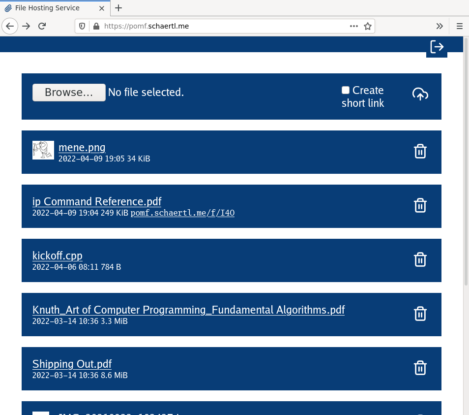

# fmajor

`fmajor` is a self-hosted file upload service. It is basic, but easy
to install.

## Features

* Upload, download and delete files all from the web interface.  Only
  users with a password can upload and delete file but *everyone can
  download all uploaded files assuming they have the link*.

* `fmajor` is compiled to one static binary, which includes all
  resources. This makes deployment easy, no need for containers or
  virtual machines.

* Doesn't require a database. All data is stored on the file system.

## What it Doesn't Do

* `fmajor` does not include transport encryption (i.e. HTTPS). Please
  use a proxy like `nginx` with TLS enabled to ensure that nobody
  listens to your login password.

## Building

Assuming you have `go` version 1.17 or later, you should only have to run

    $ go install github.com/kissen/fmajor@latest

You should now have `fmajor` available on your system.

## Setup With `systemd`

The following instructions were tested on Debian 10 and assume that
you know how to proxy and secure HTTP services with something like
`nginx`.

1. Build `fmajor` like explained in the previous section. You can do
   this on your workstation.

2. Move the `fmajor` binary to a reasonable place on your server.
   This tutorial assumes that place to be `/usr/bin/fmajor`. All following
   commands need to be run on your server as `root`.

3. Create a dedicated user for running `fmajor`.

        # adduser --home /var/lib/fmajor --shell /sbin/nologin --disabled-password fmajor

   This creates a user named `fmajor` with home directory `/var/lib/fmajor`
   which is where we will let `fmajor` put all its uploads.

4. Copy the configuration file to `/etc`.

        # wget https://raw.githubusercontent.com/kissen/fmajor/master/doc/fmajor.conf
        # mv fmajor.conf /etc/fmajor.conf

   You should now have a configuration file `/etc/fmajor.conf`.

5. You need to set up at least one password. Without a password,
   you will not be able to log in and therefore upload files.

   The easiest way is to use the `htpasswd` tool to generate the
   hash. On Debian, you can get `htpasswd` with the `apache2-utils`
   package. With it installed, run

        $ htpasswd -n -B -C 12 "" | tr -d ':\n'

   and you will be prompted for the password. The hash is printed to
   `stdout`.

   Open `/etc/fmajor.conf` with a text editor and edit section
   `PassHashes` accordingly. It should look something like

        PassHashes = [
            "$2y$12$uTLL4JVVyJg9aunt.hyraej3m0yW6siY2cAQ1MakmUxtxgR4EoPbK"
        ]

6. Install the `systemd` service file.

        # wget https://raw.githubusercontent.com/kissen/fmajor/master/doc/fmajor.service
        # mv fmajor.service /lib/systemd/system/fmajor.service
        # systemctl daemon-reload

7. You can now start the `fmajor` service with

        # systemctl start fmajor

   which will make `systemd` take care of keeping your logs. Access
   the logs using

        # journalctl -u fmajor.service

   If you want `fmajor` to start during boot, enable the service with
   `systemctl` like so

        # systemctl enable fmajor

8. `fmajor` listens to the `ListenAddress` defined in configuration
   file `/etc/fmajor.conf`. Per default, this is `localhost` which of
   course isn't very useful if you want to access the service
   remotely. To make `fmajor` accessible on the open internet,
   configure your reverse proxy (e.g. `nginx`) to forward requests to
   `ListenAddress`.

   You should configure your reverse proxy to use HTTPS, otherwise
   third parties will be able to spy on your interactions with
   `fmajor`.  [Let's Encrypt](https://letsencrypt.org/) with
   [Certbot](https://certbot.eff.org/) is the canonical choice.

## Credit

(c) 2020 - 2022 Andreas Schärtl

This program (`fmajor`) is free software: you can redistribute it and/or modify
it under the terms of the GNU General Public License as published by the Free
Software Foundation, either version 3 of the License, or (at your option) any
later version. For a copy of this license, see `LICENSE`.

### Feather Icons

Above applies only to the source code. Excluded are included icons derived from
the [Feather](https://feathericons.com/) icon set licensed under the following
terms.

    The MIT License (MIT)

    Copyright (c) 2013-2017 Cole Bemis

    Permission is hereby granted, free of charge, to any person obtaining a copy
    of this software and associated documentation files (the "Software"), to deal
    in the Software without restriction, including without limitation the rights
    to use, copy, modify, merge, publish, distribute, sublicense, and/or sell
    copies of the Software, and to permit persons to whom the Software is
    furnished to do so, subject to the following conditions:

    The above copyright notice and this permission notice shall be included in all
    copies or substantial portions of the Software.

    THE SOFTWARE IS PROVIDED "AS IS", WITHOUT WARRANTY OF ANY KIND, EXPRESS OR
    IMPLIED, INCLUDING BUT NOT LIMITED TO THE WARRANTIES OF MERCHANTABILITY,
    FITNESS FOR A PARTICULAR PURPOSE AND NONINFRINGEMENT. IN NO EVENT SHALL THE
    AUTHORS OR COPYRIGHT HOLDERS BE LIABLE FOR ANY CLAIM, DAMAGES OR OTHER
    LIABILITY, WHETHER IN AN ACTION OF CONTRACT, TORT OR OTHERWISE, ARISING FROM,
    OUT OF OR IN CONNECTION WITH THE SOFTWARE OR THE USE OR OTHER DEALINGS IN THE
    SOFTWARE.

The affected files are

    /static/svg/trash-2.svg /static/svg/paperclip.svg /static/svg/upload-cloud.svg
    /static/svg/log-out.svg /static/svg/x-octagon.svg

### Fonts

This repository contains file `/static/fonts/goregular.woff` which is based on the open source
[Go Regular](https://github.com/golang/image/tree/master/font/gofont/ttfs) font.
Go Regular is distributed under the following conditions.

    These fonts were created by the Bigelow & Holmes foundry specifically for the
    Go project. See https://blog.golang.org/go-fonts for details.

    They are licensed under the same open source license as the rest of the Go
    project's software:

    Copyright (c) 2016 Bigelow & Holmes Inc.. All rights reserved.

    Distribution of this font is governed by the following license. If you do not
    agree to this license, including the disclaimer, do not distribute or modify
    this font.

    Redistribution and use in source and binary forms, with or without
    modification, are permitted provided that the following conditions are met:

            * Redistributions of source code must retain the above copyright notice,
            this list of conditions and the following disclaimer.

            * Redistributions in binary form must reproduce the above copyright notice,
            this list of conditions and the following disclaimer in the documentation
            and/or other materials provided with the distribution.

            * Neither the name of Google Inc. nor the names of its contributors may be
            used to endorse or promote products derived from this software without
            specific prior written permission.

    DISCLAIMER: THIS SOFTWARE IS PROVIDED BY THE COPYRIGHT HOLDERS AND CONTRIBUTORS
    "AS IS" AND ANY EXPRESS OR IMPLIED WARRANTIES, INCLUDING, BUT NOT LIMITED TO,
    THE IMPLIED WARRANTIES OF MERCHANTABILITY AND FITNESS FOR A PARTICULAR PURPOSE
    ARE DISCLAIMED. IN NO EVENT SHALL THE COPYRIGHT OWNER OR CONTRIBUTORS BE LIABLE
    FOR ANY DIRECT, INDIRECT, INCIDENTAL, SPECIAL, EXEMPLARY, OR CONSEQUENTIAL
    DAMAGES (INCLUDING, BUT NOT LIMITED TO, PROCUREMENT OF SUBSTITUTE GOODS OR
    SERVICES; LOSS OF USE, DATA, OR PROFITS; OR BUSINESS INTERRUPTION) HOWEVER
    CAUSED AND ON ANY THEORY OF LIABILITY, WHETHER IN CONTRACT, STRICT LIABILITY,
    OR TORT (INCLUDING NEGLIGENCE OR OTHERWISE) ARISING IN ANY WAY OUT OF THE USE
    OF THIS SOFTWARE, EVEN IF ADVISED OF THE POSSIBILITY OF SUCH DAMAGE.
